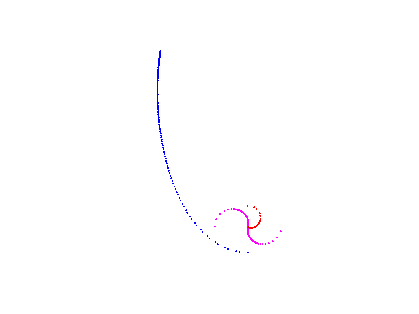

eom
===

Equations of Motion for Astrodynamics
-------------------------------------

The Equations of Motion project provides an application with
astrodynamics related functionality along with a library to aid in the
creation of custom tools.

User Guide:  <https://motoq.github.io/doc/eom.html>

eomx
----

The **eomx** application is being designed to focus on orbit
propagation, orbit determination, relative orbital dynamics, and
attitude dynamics.  It is a command line program driven by a simple text
based modeling language.  The library allows rapid development of custom
applications.

Current functionality includes orbit propagation via general
perturbation (GP, "analytic") and special perturbation (SP, numerical
integration) techniques.  Externally generated SP3 formatted ephemerides
(CDDIS) can also be ingested.  Ephemerides can be saved in STK
compatible **.e** file formats.  Other outputs are written as Matlab
(Octave compatible) functions.  When run, these **.m** files will plot
the data with appropriate formatting while optionally returning the
handle to the figure along with the raw data.  For example, the range as
a function of time between two orbits can be generated and displayed in
a 2D plot.  Likewise, relative orbits can be output in an RTC
coordinates for a 3D plot.

The IAU 2000A and IAU 2006 precession-nutation theories are supported,
including parsing of IERS EOP data.  In addition to the GCRF and ITRF
reference frames, internal support for TEME (true equator, mean equinox,
GMST 1980) exists.  This ECI reference frame is included for use with
legacy GP propagators (such as the Vinti, traditional secular J2, and
SGP based theories).

The library is designed with thread safety in mind.  Shared resources
(ECF/ECI transformation services, ephemerides, etc.) are available as
immutable objects.  SP based ephemerides are generated taking advantage
of parallel loop processing available since C++17.

**eom** utilizes two mature libraries upon which built-in models
rely and external libraries may leverage.  The first is the
International Astronomical Union Standards of Fundamental Astronomy (IAU
SOFA) C library <http://www.iausofa.org/>.  Installation of SOFA-Issue
2015-02-09 or newer is required to build **eom**.  The second library is
the Eigen 3 C++ template library for linear algebra
<http://eigen.tuxfamily.org>.  In the future, Kitware’s VTK OpenGL
library may be used for direct plotting of graphics.

Core concepts behind **eom** are:

1. Provide useful built in astrodynamics models and analysis tools
2. Provide convenient access to SOFA functionality
3. Supply an interface to external legacy libraries that have fallen out
   of use simply because the GUI supporting them can no longer be
   maintained
4. Provide a tool that allows for easy comparison of results from
   different functions and/or libraries
5. Provide a framework in which short response analysis can be addressed
   or algorithms prototyped

C++ was chosen for development because:

1. It plays well with legacy C and FORTRAN libraries
2. A number of mature and fast C++ math libraries are available
3. Code designed to run on hardware can be tested
4. Modern C++ is a really great language, despite all the baggage (a
   C++17 compatible compiler is required)

The Mozilla Public License 2.0 (MPL2) was chosen because it protects the
open source nature of this code while still allowing it to be used with
proprietary and closed source tools:
<https://www.mozilla.org/en-US/MPL/2.0/>

Build Instructions
------------------

CMake was chosen over the use of a Makefile to support the potential of
directly generating graphics via Kitware’s VTK OpenGL library.  In
theory, it should aid in building **eom** under different platforms.  So
far, **eom** has only been built under Linux systems.  Updates to the
CMake configuration will be made as deficiencies are discovered.

In addition to CMake, the Eigen C++ math library must be installed.
CMake is currently configured to rely on automatically locating Eigen.
If this fails, then CMake must be manually configured to point to the
location of the Eigen header files.  More information is available at
the Eigen site <http://eigen.tuxfamily.org>.

The final dependency is the IAU SOFA C library.  On a typical Linux
distribution, this may be the only external dependency that needs to be
installed.  Download the latest release from <http://www.iausofa.org/>
and follow the build instructions.  Next, search for "SOFA" in the
CMakeLists.txt configuration file.  Update the path to where the include
and library files were installed when building SOFA.

Once CMake, Eigen, and SOFA are installed, check that the line

*set(USE_GENPL TRUE)*

is commented out in the CMakeLists.txt file.  This line enables an
external astrodynamics library that is not included with this repository.
It is often left uncommented (enabled).  The *GENPL* keyword also serves
as an example within both the build file and source code w.r.t.
including 3rd party libraries within **eom** and **eomx**.

At this point, the standard CMake build process can be followed.  Change
to the *build* directory.  Type,

*cmake ..*

*make*

to build both the **eom** library and the **eomx** application.  To
build only the library,

*make eom*

